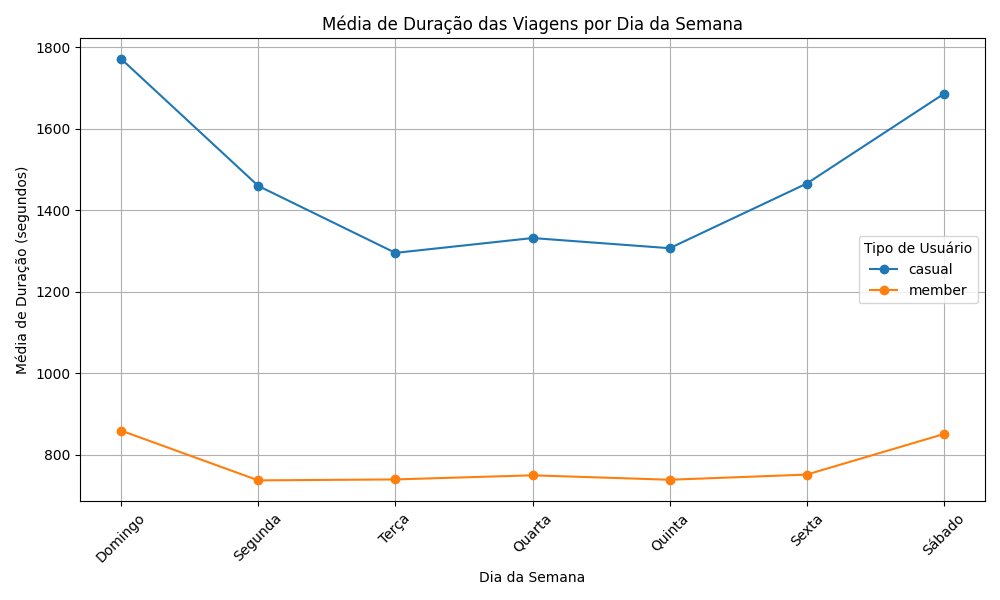
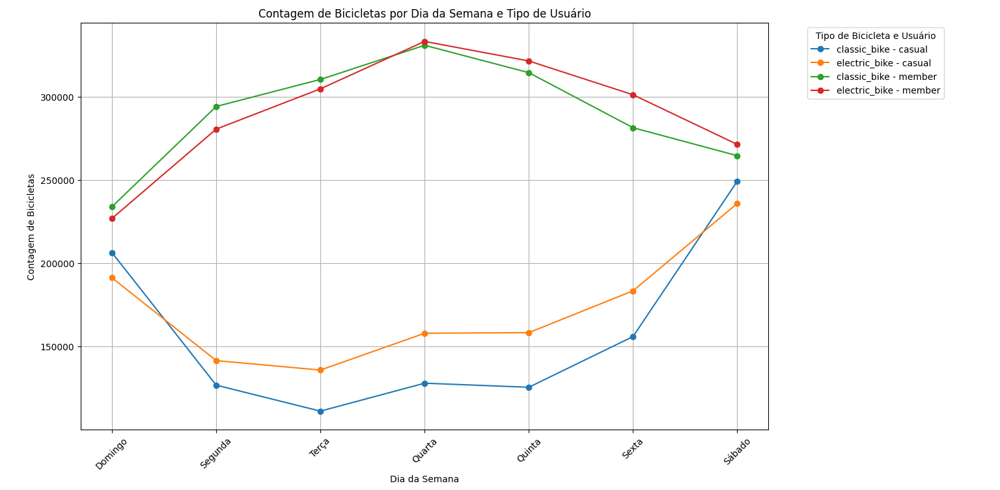

# Observações dos Gráficos

## Média de Duração das Viagens por Dia da Semana

Neste gráfico, observamos que os usuários casuais têm um tempo médio de viagem maior do que os usuários anuais. Além disso, em ambos os casos, há um aumento nas viagens durante o fim de semana, com os usuários anuais apresentando menor variação no número de viagens ao longo da semana. Já os usuários casuais realizam mais viagens em dias próximos ao fim de semana, como segunda-feira e sexta-feira.

## Contagem de Bicicletas por Dia da Semana e Tipo de Usuário

Observamos um aumento no uso de bicicletas do tipo Classic e Electric durante os dias úteis para os usuários anuais, enquanto, em contrapartida, há uma queda nesses mesmos dias para os usuários casuais. Também identificamos uma redução no uso nos finais de semana por parte dos usuários anuais, com um aumento correspondente entre os usuários casuais.

O tipo de bicicleta *Electric Scooter* foi desconsiderado da análise por não apresentar dados suficientes, além de prejudicar a visualização dos demais resultados.

## Insights dos Dados

Observamos que, na **Figura 1**, os usuários anuais apresentam um tempo médio de viagem com baixa variação. Por outro lado, os usuários casuais mostram uma variação maior no tempo médio de viagem, especialmente com um aumento durante os finais de semana.

Já na **Figura 2**, notamos que os usuários anuais realizam a maior parte das viagens durante a semana, com uma queda significativa no final de semana. Em contraste, os usuários casuais seguem o padrão oposto: suas viagens aumentam nos finais de semana e diminuem durante a semana.

Combinando essas duas observações, é possível sugerir que o menor tempo médio de viagem entre os usuários anuais pode estar relacionado ao fato de utilizarem rotas repetitivas – provavelmente o mesmo ponto de partida e destino em vários dias. Isso, somado ao aumento das viagens nos dias úteis, sugere que esses usuários podem estar realizando atividades ligadas a horários comerciais, como o deslocamento para o trabalho.
